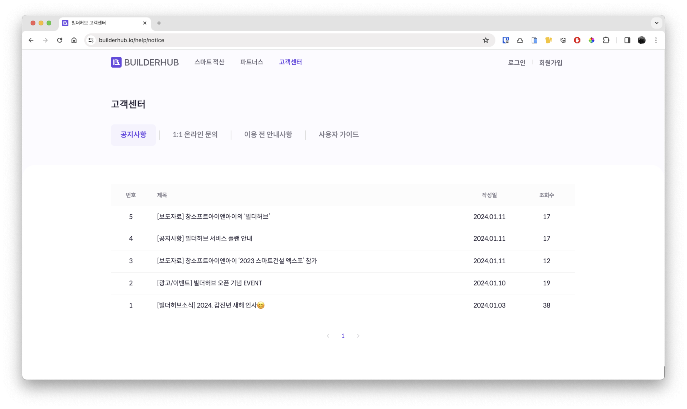
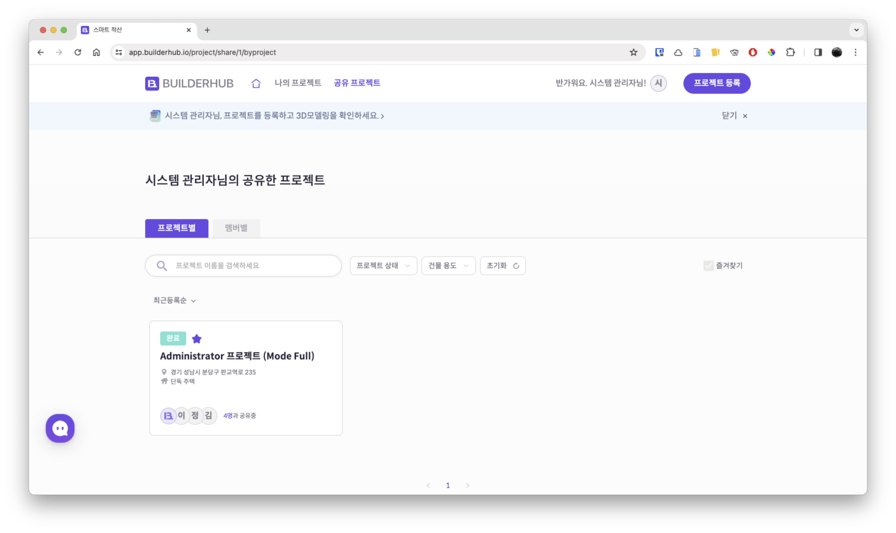
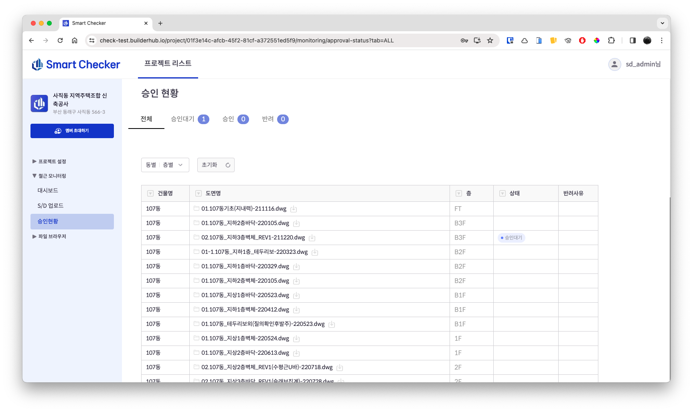
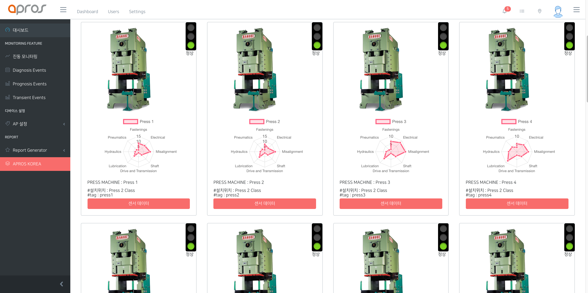
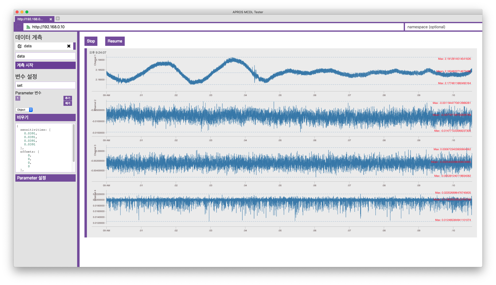
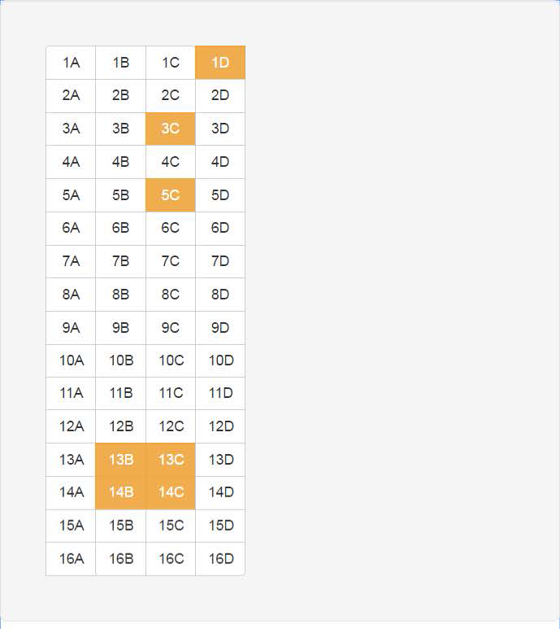
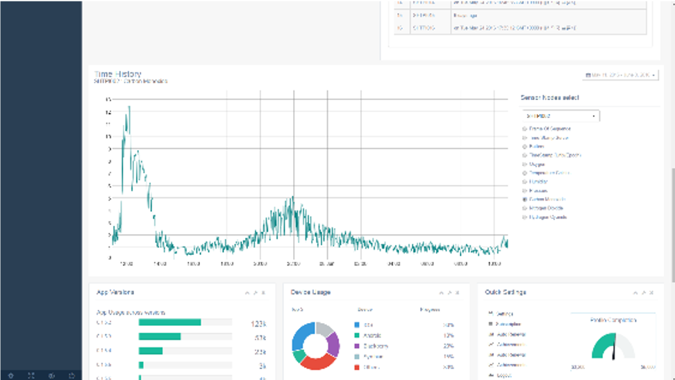

-   소개: 건축을 시작하기 위한 그리고 건축 관련 관계자들을 위한 허브

-   1차 목표: 건축 견적 시장을 점유하여 플레이어들을 위한 서비스들을
    만들어 플랫폼화

-   참여 개발 내용: 플랫폼 개발 본부 리딩, 인프라 및 풀스택 플랫폼
    서비스 구축

-   개발 서비스

    -   [홈 서비스](https://builderhub.io) 개발

        -   각 서비스들의 허브

        -   고객센터, 1:1문의, ChatOps, 설문조사 챗봇

        -   CMS: Notion API(NextJS SSG&SSR)

        <figure>
        <div class="fullwidth">
        
        
        
        
        </div>
        <figcaption>Guide</figcaption>
        </figure>

    -   [인증 서비스](https://auth.builderhub.io) 개발(회원가입, 로그인
        세션, 마이페이지, 1:1문의 내역)

        -   회원가입, 로그인

        -   로그인 세션 확인, 마이페이지, 1:1 문의 내역

        -   SuperTokens(cIAM) API 커스텀, JWT & Session 방식 인증&인가,
            RBAC, OIDC

        <figure>
        <div class="fullwidth">
        
        
        
        </div>
        <figcaption>My Page</figcaption>
        </figure>

    -   [커스터머 서비스](https://app.builderhub.io) 개발

        -   랜딩페이지, 프로젝트 리스트, 등록, 공유, 필터

        -   프로젝트 상태 확인, 결제 시스템, 알림톡 연동

        -   프로젝트 상세 확인, 변경 내역 히스토리

        -   표준내역서 관리, 내역화 (개발중)

        <figure>
        <div class="fullwidth">
        
        
        
        
        
        
        
        
        </div>
        <figcaption>Project history &amp; detail</figcaption>
        </figure>

    -   [큐레이션 서비스](https://curation.builderhub.io/project/tester)
        개발

        -   BIM 모델 3D 뷰어: Three.js, Forge API, Zoom to Control,
            First-person View Control

        -   내역 필터 및 검색: Floor Filter, Material Filter, Table
            Filter, Search

        -   모델 툴 개발: Section View, Screenshot, Measurement

        -   자재 변경, 도면 뷰어

        -   공정 시뮬레이션, 공정표 제공: Gantt Chart, Work simulation
            (on developing)

        <figure>
        <div class="fullwidth">
        
        
        
        
        
        
        
        
        
        
        
        
        
        
        
        
        </div>
        <figcaption>2D drawing view</figcaption>
        </figure>

    -   [파트너 서비스](https://partners.builderhub.io/) 개발(파트너
        등록 및 검수, 공공 API 및 공공 데이터 연동 파트너 정보 등록,
        포트폴리오 등록, 블로그 및 콘텐츠 서비스)

        -   파트너 등록 및 검수, 대시보드, 프로필 수정

        -   공공 API 및 공공 데이터 연동 파트너 정보 등록, 포트폴리오
            등록, 블로그 및 콘텐츠 서비스 (개발중)

        <figure>
        <div class="fullwidth">
        
        
        
        
        </div>
        <figcaption>Edit profile</figcaption>
        </figure>

    -   [빌더허브 운영 어드민 (Back
        office)](https://admin.prod.platform.builderhub.io/)
        개발(프로젝트 검수, 파트너 검수, 알림톡 송출, 결제 확인,
        프로젝트 에셋 등록, 표준내역서 관리, 1:1문의 답변, FAQ 작성 등)

        -   프로젝트 검수, 파트너 검수, 알림톡 송출, 결제 확인

        -   프로젝트 에셋 등록, 표준내역서 관리, 1:1문의 답변, FAQ 작성

        <figure>
        <div class="fullwidth">
        
        
        
        
        
        
        
        
        </div>
        <figcaption>Settings</figcaption>
        </figure>

    -   플랫폼 컨버터 개발

        -   솔루션 데이터 프리프로세싱, 디폴트 값 추가

        -   비내역화 데이터 계산 및 추가, 표준내역서 매핑, 공사비 데이터
            매핑 및 공사비 산출

        -   솔루션 BIM 모델데이터 업로드 및 변환

        -   개발 스택: TypeScript, NodeJS, ElectronJS, NextJS(Nextron),
            Default data and Validator(AJV), CSV Parser(papaparse)

        <figure>
        <div class="fullwidth">
        
        
        
        </div>
        <figcaption>Converted: Mapping</figcaption>
        </figure>

    -   인프라 구성:

        -   1차 코드형 인프라(IaC: AWS Copilot, AWS CDK 2022.06 -
            2022.10): AWS CloudFormation, Amplify, Cognito, ALB, RDS,
            Lambda, API Gateway, S3, CloudFront

        -   2차 코드형 인프라(IaC: Terraform 2022.11 - 2023.12): AWS
            ECS, RDS, Lambda, API Gateway, S3, CloudFront, SES 등

        -   3차 쿠버네티스 인프라(IaC: Terraform, Helm Chart 2023.12 -
            now): EKS, ELB, PostgreSQL, Prometheus, Grafana, ArgoCD,
            Github Action, Nginx, Supertokens 등

        <figure>
        <div class="fullwidth">
        
        
        </div>
        <figcaption>EKS Infra</figcaption>
        </figure>

    -   백엔드 개발 스택: TypeScript, NodeJS, Apollo Server, Code first
        GraphQL Schema, GraphQL Codegen, Nexus Framework, PalJS, OAS
        REST API 등

    -   프론트엔드 개발 스택: TypeScript, NextJS, ReactJS, Redux
        toolkit, XState, Threejs, Autodesk Forge SDK

```{=html}
<!-- -->
```
-   [스마트체커](https://check.builderhub.io/signin)(철근 모니터링
    시스템, 시공사 대상 B2B) 프로젝트 개발

    -   개발 기간: 3개월

    -   개발 인원: 4명

    -   개발한 서비스

        -   스마트체커 서비스: 자사 솔루션 제품 데이터(Builderhub Q,
            2DShopPro)를 활용한 철근 물량 검토 서비스

        -   파일클라우드: 웹하드 대체를 위한 파일클라우드 개발

        -   이슈 트래킹: 도면 또는 자체 이슈들을 관리하기 위한 이슈관리
            서비스 개발

        -   도면 컨버터 개발: 철근 샵도면을 읽어 물량 정보 및
            메타데이터를 추출 및 도면 뷰어를 위한 데이터 컨버팅

        <figure>
        <div class="fullwidth">
        
        
        
        
        
        
        
        
        </div>
        <figcaption>클라우드 파일 관리</figcaption>
        </figure>

    -   인프라 구성:

        -   쿠버네티스 인프라 구성: EKS, ELB, Prometheus, Grafana,
            ArgoCD, Github Action, Nginx, Supertokens 등

        -   Turbo Repo 구성: 모노 리포지토리에서 모든 앱과 패키지들을
            통합하여 관리 및 배포

    -   백엔드 & 프론트 개발 스택: TypeScript, NodeJS, Apollo Server,
        Code first GraphQL Schema, GraphQL Codegen, Nexus Framework,
        PalJS, OAS REST API, NextJS

    <figure>
    <div class="fullwidth">
    
    
    
    
    
    
    
    
    </div>
    <figcaption>회원 마이페이지</figcaption>
    </figure>

```{=html}
<!-- -->
```
-   개발 기간: 3주

-   개발 인원: 2명

-   개발한 서비스

    -   건축 공정표와 공정 체크리스트, 모델 연동, 공장 가공 철근 부재별
        체크하여 사진 업로드

    -   URL에 해당 데이터 저장 및 S3 이미지 업로드, URL Shortener, 공장
        가공 철근 QR Code 연동

<figure>
<div class="fullwidth">


</div>
<figcaption>Architecture milestones</figcaption>
</figure>

-   AD.Fi: 인터넷 WiFi 공유기 광고 시스템(매장 광고 송출, 광고 관리,
    매장, 브랜드, 영업사원, 대리점, 총판 관리) 개발

    -   개발 기간: 6개월

    -   유지관리 기간: 18개월

    -   개발 인원: 5명

    -   개발한 서비스

        -   공유기 광고 송출 페이지: Captive Portal 광고 노출 및 인터넷
            연결 허용

            <figure>
            <div class="fullwidth">
            
            
            </div>
            <figcaption>공유기 광고 송출</figcaption>
            </figure>

        -   광고 집계 및 광고 관리 백오피스: 매장주, 영업사원, 대리점,
            총판, 브랜드, 브랜드그룹 어드민

            <figure>
            <div class="fullwidth">
            
            
            
            
            
            
            
            
            </div>
            <figcaption>대리점 관리</figcaption>
            </figure>

        -   타겟광고 트래킹 시스템 개발

    -   인프라 구성:

        <figure>
        <div class="fullwidth">
        
        </div>
        <figcaption>AWS 인프라 구성</figcaption>
        </figure>

        -   AWS EC2, CodePipeline, AutoScalingGroup, S3, Lambda

        -   Linux system daemon(systemd) and timer

        -   Docker swarm stack: Microservice containers

        <figure>
        <div class="fullwidth">
        
        </div>
        <figcaption>AWS 배포 파이프라인</figcaption>
        </figure>

    -   백엔드 개발 스택

        -   Type-safe pipeline: TypeScript, NodeJS, Express, Apollo
            Server, Prisma ORM, Nexus GraphQL, Open API Spec. v3

        -   Code-first GraphQL schema: Nexus-GraphQL

        -   Asynchronosus API: Mosquitto, MQTTjs, Async API

    -   프론트 개발 스택

        -   TypeScript, ReactJS, Context API, Material UI, Styled
            Component, JSS

        -   GraphQL-codegen(React, Apollo-client)

    <figure>
    <div class="fullwidth">
    
    </div>
    <figcaption>AD.Fi Captive portal</figcaption>
    </figure>

```{=html}
<!-- -->
```
-   개발 기간: 2주

-   개발 인력: 1인

-   개발한 서비스

    -   체크인 페이지: Captive Portal 브라우저에서 방문자 기록

    -   어드민 개발: 사용자 리스트

    -   이후 공유기 설정 및 등록 페이지로 활용, 공유기 가등록 및 판매

```{=html}
<!-- -->
```
-   Lucky.Fi(매장 경품추첨 앱) 개발

    -   개발 기간: 4주

    -   개발 인력: 5인

    -   개발한 서비스

        -   룰렛 게임: Captive Portal 브라우저에서 룰렛게임, 당첨자
            회원가입

        -   상품 연동: 쿠프마케팅 기프티콘, 밀크코인

        -   코인 적립: SRT 코인 적립

        -   브라우저 핑거프린트: 사용자 특정 및 매장 방문 확인

```{=html}
<!-- -->
```
-   강릉시 공공 WiFi 개발, 코엑스 전시장 AD.Fi 서비스

    -   개발 기간: 4주

    -   개발 인력: 2인

    -   개발한 서비스

        -   공공 와이파이 연동: Xirrus, Meraki, Lucus 공유기 연동, Grant
            API 개발

        -   RADIUS 인증 연동: 자사 RADIUS 서버 연동, 사용자 정보 트래킹

        <figure>
        <div class="fullwidth">
        
        
        
        
        </div>
        <figcaption>미리보기</figcaption>
        </figure>

    -   인프라 구성:

        -   Bare Metal 서버 구축

        -   Docker swarm stack: Traefik, MongoDB Cluster

    -   풀 개발 스택

        -   TypeScript, NodeJS, NextJS, Prisma ORM(MongoDB), Redux
            Toolkit Query

        -   GraphQL-codegen(Apollo-client)

    <figure>
    <div class="fullwidth">
    
    </div>
    <figcaption>공공 WiFi Captive portal</figcaption>
    </figure>

<figure>
<div class="fullwidth">

</div>
<figcaption>Cash Fi</figcaption>
</figure>

-   Cash.Fi(매장 모객 서비스) 백엔드 개발

    -   총 개발 기간: 19개월 (외주 관리)

    -   해당 개발 기간: 6주

    -   개발 인력: 1인

    -   개발한 서비스

        -   WiFi indoor position: WiFi 공유기와 Captive portal 연동,
            매장 내부 위치 트래킹

        -   WiFi 공유기 매장 fingerprint 수집: 공유기 AP를 이용 매장
            특정 Fingerprint 개발(7종의 ML 알고리즘)

        -   외주 개발 백엔드 마이그레이션: DB 마이그레이션, AD-Fi 매장
            연동

    -   인프라 구성:

        -   AWS EC2, RDS, S3, Lambda, CloudFront

        -   Docker swarm stack: Traefik

    -   백엔드 스택

        -   TypeScript, NodeJS, Express, Apollo Server, Prisma ORM

```{=html}
<!-- -->
```
-   소개: 스마트팩토리 IIoT PdM 솔루션 개발

-   참여 개발 내용: Edge Device(DAQ/Analysis) 애플리케이션 개발,
    웹플랫폼 개발

-   개발 스택 및 프레임워크: \*nix, NodeJS N-API, C++, golang, Python,
    Redis, MongoDB, GraphQL, ReactJS

-   SK하이닉스, SK텔레콤, KETI, 남강정밀등

-   참여 개발 내용

    -   데이터 분석: Diagnosis(HMB-SD 기법 적용, Deep analyzed
        features), Prognosis(유사성기반 RUL 추정기법)

    -   Anomaly detection, Disgnosis, Prognosis, Transient event 분류
        데이터 누적

    -   MQTT 브로커, Kafka 분산 메시지 큐, DB구축, GraphQL API 구축

    -   디바이스 관리 클라이언트, 플랫폼 클라이언트 개발 (ReactJS)

-   개발 스택 및 프레임워크: JavaScript(ES6), Babel, NodeJS, C++,
    golang, GraphQL, ReactJS, ElectronJS, Python

-   현장 테스트베드 가동: 80여개소 디플로이 및 유지관리

<figure>
<div class="fullwidth">




</div>
<figcaption>Data logger tool (ElectronJS)</figcaption>
</figure>

-   소개: 철도 콘크리트 도상 균열 자동 탐지 과제

-   참여 개발 내용: 연구책임자

    -   레이저 라인 스캔카메라를 이용한 고해상도 이미지 취득후 균열 탐지
        (0.3x0.22mm)

    -   Phothmetric normalization과 B-COSFIRE Filter(DoG response)를
        사용하여 TCL층의 라인구조식별

    -   Machine learning(support vector machine)을 이용하여 도상
        구조물과 균열을 분류

    -   분류된 균열 그리고 도상 구조물을 ground truth로 분리하여
        CNN(convolutional neural network) 학습.

-   개발 스택 및 프레임워크: MATLAB, Python, Tensor flow(CNN), OpenCV

-   현장 테스트베드 가동(Trolley 방식), 선로검측차 탑재

-   [링크
    참조](https://www.eunchurn.com/blog/engineering/2017-12-30-concrete-cracks-detection-using-b-cosfire-filter)

<figure>
<div class="fullwidth">


</div>
<figcaption>0.2mm 미세균열 검출</figcaption>
</figure>

-   소개: 컴퓨터 비젼(OpenCV) 및 이미지 프로세싱을 이용한 승객 착석유무
    판단

-   참여 개발 내용: 현장 CCTV를 통해 이미지 취득 후 컴퓨터 비젼 프로세싱

-   개발 스택 및 프레임워크: C++ 기반 OpenCV, JavaScript(ES5), NodeJS,
    Express, EJS, Redis, MongoDB

-   KTX 1편성, ITX-청춘 1편성 현장 적용 완료

<figure>
<div class="fullwidth">



</div>
<figcaption>Raspberry Pi 탑재용 테스트 프로그램</figcaption>
</figure>

-   소개: 컴퓨터 비젼(OpenCV) 및 이미지 프로세싱을 이용한 낙석감지 알람

-   참여 개발 내용

    -   현장 CCTV를 통해 이미지 취득 후 컴퓨터 비젼 프로세싱

    -   애플리케이션 개발: Raspberry Pi, NodeJS 애플리케이션(OpenCV,
        nodeJS, Redis, MongoDB 웹서버 및 UI가동)

    <figure>
    <div class="fullwidth">
    
    
    
    </div>
    <figcaption>이벤트 뷰 &gt; SMS 메시지 전송</figcaption>
    </figure>

-   개발 스택 및 프레임워크

    -   C++ 기반 OpenCV

    -   NVidia Jetson TX-1을 이용한 컴퓨터 비전 활용

    -   JavaScript(ES5), NodeJS, Express, SocketIO 푸시 알림 웹서버
        (Redis, MongoDB)

-   현장 테스트베드 가동, 160여개소 적용 준비

```{=html}
<!-- -->
```
-   소개: 가스센서 노드로부터 데이터를 받아 화재 및 재난을 초기 인식하여
    승객들에게 대피경로를 안내하는 시스템

-   참여 개발 내용:

    -   Libelium Waspmote기반 가스센서 펌웨어 개발

    -   가스센서 Calibration : MATLAB을 이용하여 기준값 측정 후 곡선적합

    -   게이트웨이 개발: Raspberry Pi [nodeJS](https://nodejs.org)
        애플리케이션(serial parsing, Redis, MongoDB, 웹서버 및
        클라이언트 개발)

        <figure>
        <div class="fullwidth">
        
        
        </div>
        <figcaption>센서 캘리브레이션, 데이터 조회</figcaption>
        </figure>

    -   센서노드 API 제작(Plug&Sense): sleep time 스케쥴링

    -   화재 감지 및 화재 발생 위치 분석: 주요요소분석(principal
        component analysis, 각 센서데이터의 확률밀도함수와 이벤트간
        주요요소분석), 확률변수시물레이션(Monte-Carlo 시물레이션)

    -   Markov-chain 룰을 통해 상태예측 알고리즘 개발

    -   대피경로 안내 시스템 개발(역무원용/승객 알림용)

        <figure>
        <div class="fullwidth">
        
        </div>
        <figcaption>대피경로 안내 시나리오 설정</figcaption>
        </figure>

        <figure>
        <div class="fullwidth">
        
        </div>
        <figcaption>승객용 재난 발생 위치 알림</figcaption>
        </figure>

        <figure>
        <div class="fullwidth">
        
        </div>
        <figcaption>센서 Matrix Rule set 지정</figcaption>
        </figure>

-   적용된 기술:

    -   [M2M](https://en.wikipedia.org/wiki/Machine_to_machine)

    -   [LoRa](https://lora-alliance.org/) 802.11ah SX1274 916MHz

    -   [Principal component
        analysis](https://en.wikipedia.org/wiki/Principal_component_analysis)

    -   [Monte Carlo
        method](https://en.wikipedia.org/wiki/Monte_Carlo_method)

    -   [Markov chain](https://en.wikipedia.org/wiki/Markov_chain)

-   개발 스택 및 프레임워크

    -   적합성 데이터 분석 및 센서 캘리브레이션: Mathworks MATLAB

    -   센서 관리 웹어드민: JavaScript(ES5), NodeJS, Express, React,
        Webpack

    -   센서 데이터 송신 펌웨어: C (Libelium SDK)

    -   센서 특징 정보 추출: Python

    -   대피경로 안내 시스템: Django

-   참여한 현장: 대공원역 / 개포동역

```{=html}
<!-- -->
```
-   소개: 온풍, 음이온 생성기, 응결핵등을 방사하여 도로상에 안개를
    신속히 제거하는 시스템

-   참여 개발 내용

    -   CCTV 영상이미지를 이용한 안개시정거리 계산: [Feature
        detection](https://en.wikipedia.org/wiki/Feature_detection_(computer_vision))

    -   오브젝트 트래킹 문제: [Partial least square
        analysis](https://en.wikipedia.org/wiki/Partial_least_squares_regression)를
        통해 타깃의 위치 판탄 (2stage filtering)

    -   [Real-time compressive
        tracking](http://www4.comp.polyu.edu.hk/~cslzhang/CT/CT.htm):
        [multiscale
        filterbank](https://en.wikipedia.org/wiki/Filter_bank)를 통해
        [feature
        detection](https://en.wikipedia.org/wiki/Feature_detection_(computer_vision))
        후 매트릭스방식의 feature를 벡터화

    -   오브젝트 트래킹 에러로 success rate, average center location
        error를 판단하여 시정거리와 매핑.

    -   [Sum of squared
        difference](https://siddhantahuja.wordpress.com/tag/sum-of-squared-differences/)
        [Normalized
        cross-correlation](https://en.wikipedia.org/wiki/Cross-correlation#Normalized_cross-correlation)
        으로 최종 매핑 스코어 판정

    -   CCTV 이미지를 통해 안개소산장치를 ON/OFF 제어 : 평균화 방식의
        [PID 제어기](https://en.wikipedia.org/wiki/PID_controller)로
        설계

    <figure>
    <div class="fullwidth">
    
    
    </div>
    <figcaption>시정거리 계산 / PID 제어</figcaption>
    </figure>

```{=html}
<!-- -->
```
-   소개: 건물의 사용중 진동 저감을 위한 능동형 제진장치 설치 및
    모니터링 플랫폼 개발 프로젝트

-   참여 개발 내용:

    -   [Quansar 소형 AMD
        제어](http://www.quanser.com/products/active_mass_damper),
        [LQR](https://en.wikipedia.org/wiki/Linear-quadratic_regulator)/[LQG](https://en.wikipedia.org/wiki/Linear-quadratic-Gaussian_control)
        알고리즘 탑재.

    -   실제 현장에서 계측데이터 품질 확보를 위한 signal conditioning

    -   High-resolution DAQ 적용

    -   Raspberry Pi를 이용한 PLC, DAQ, Anemometer 데이터 송출

    -   MQTT Broker를 통한 데이터 표출 API 개발

    -   모니터링 웹애플리케이션 개발

    <figure>
    <div class="fullwidth">
    
    
    
    
    
    
    </div>
    <figcaption>RT. Wind mon.</figcaption>
    </figure>

-   적용된 기술:

    -   [LQR](https://en.wikipedia.org/wiki/Linear-quadratic_regulator)/[LQG](https://en.wikipedia.org/wiki/Linear-quadratic-Gaussian_control)
        control algorithm

    -   [sliding mode
        control](https://en.wikipedia.org/wiki/Sliding_mode_control)[^1]
        algorithm

    -   [velocity feedback
        control](https://en.wikipedia.org/wiki/Minor_loop_feedback)
        algorithm

    -   [ADS1282-HT (High-Resolution Analog-To-Digital
        Conversion)](http://www.ti.com/lit/ds/symlink/ads1282-ht.pdf)

    -   Signal conditioning

    -   [PLC(Programmable Logic
        Controller)](https://en.wikipedia.org/wiki/Programmable_logic_controller)

    -   Javascript(ES5), NodeJS, Express, GraphQL

    -   Socket.io

    -   MQTT (CBOR)

    -   MongoDB

    -   ReactJS

-   개발 스택 및 프레임워크

    -   Mathworks MATLAB / GUI / Simulink

    -   National Instruments LabVIEW

    -   nodeJS

-   참여한 현장: 강변 테크노마트 AMD 시공 프로젝트

```{=html}
<!-- -->
```
-   소개: 초고층건물의 시공중/사용중 계측 모니터링 : 주로 FBG,
    지진가속도계, 가속도계, GPS, 풍향풍속계 사용.

-   참여 개발 내용

    -   [SNR](https://en.wikipedia.org/wiki/Signal-to-noise_ratio)
        125dB\~130dB 이상의 센서에 적합한
        [DAQ](https://en.wikipedia.org/wiki/Data_acquisition) 보드 개발:
        저주파와 신호대잡음비 성능이 우수한 가속도계 센서에 적합한
        [DAQ](https://en.wikipedia.org/wiki/Data_acquisition)는 사실상
        고가임. 따라서 설치가 용이한 유선 네트워크방식의
        [DAQ](https://en.wikipedia.org/wiki/Data_acquisition)보드 개발이
        필요하여 개발참여.

    -   [Session-based
        interface](http://kr.mathworks.com/help/daq/examples/getting-started-with-session-based-interface-using-ni-devices.html)
        프로그래밍으로 데이터수집을 다른 thread로 작동시킴과 동시에
        분석과 해석이 동시에 이루어짐 (실시간 모드벡터 추출/FFT또는
        파워스펙트럼 그래프도시)

        <figure>
        <div class="fullwidth">
        
        
        
        </div>
        <figcaption>Modal analysis (FDD/SSI)</figcaption>
        </figure>

    -   시각동기화 프로토콜 적용 [IEEE-1588 Precision Time
        Protocol](https://ko.wikipedia.org/wiki/IEEE_1588)[^2] : GPS
        클럭을 모든 장비에 연결하려면 많은 인력과 비용이 소모됨. 따라서
        유선네트워크 방식에서의 동기화 프로토콜을 적용 (펌웨어단계에서
        클럭동기화에 성공)

    -   지진경보 시스템 : 여러동의 건물의 경우 각동 지하에
        지진가속도계를 설치하여 지진경보를 발령. 이때 각동의
        EPGA[^3]값으로 rms-triggering 적용 각 3개의 동에서 동시에 임계값
        이상이 발생하였을 때 지진으로 판정.

    -   모드정보 추출 : SSI(Stochastic subspace identification)[^4]
        기법과 [FDD(Frequency domain
        decomposition)](https://en.wikipedia.org/wiki/Frequency_domain_decomposition)[^5]
        기법을 적용

    <figure>
    <div class="fullwidth">
    
    
    </div>
    <figcaption>Details</figcaption>
    </figure>

-   적용된 기술:

    -   [Data acquisition toolbox
        (MATLAB)](http://kr.mathworks.com/products/daq/)

    -   [IEEE-1588 Precision Time
        Protocol](https://ko.wikipedia.org/wiki/IEEE_1588)

    -   High-Resolution Analog-To-Digital Conversion

    -   Stochastic subspace identification

    -   Frequency domain decomposition

    -   [Eigensystem Realization
        Algorithm](https://en.wikipedia.org/wiki/Eigensystem_realization_algorithm)

    -   [FE Model
        update](https://en.wikipedia.org/wiki/Finite_element_updating)[^6]
        / [System
        Identification](https://en.wikipedia.org/wiki/System_identification)[^7]

-   개발 스택 및 프레임워크: Mathworks MATLAB / GUI

-   참여한 현장:

    -   부산 해운대 두산위브더제니스 (사용중계측 SHM)

    -   인천 송도 NEATT 동북아무역센터 (시공중계측)

    -   롯데 잠실 슈퍼타워 (RFP지원&자문)

    -   송도 M1 주상복합 (자문)

```{=html}
<!-- -->
```
-   소개: Glass를 옮기는 이송로봇에 3축가속도계 1기 설치하여
    로봇관절운동의 패턴을 분류하고 초기치에 비해 변화량을 모니터링 해서
    각 파트의 이상을 미리 감지.

-   프로젝트 목표: 제조사측은 사전진단([Eearly Warning System,
    EWS](https://en.wikipedia.org/wiki/Early_warning_system))과 부품별
    파트진단([Prediction Management Program,
    PMP](https://en.wikipedia.org/wiki/Predictive_maintenance))을
    수행하기 원함.

-   참여 개발 내용

    -   신호분리기법 적용: [Hankel
        Matrix](https://en.wikipedia.org/wiki/Hankel_matrix)와 [Singular
        value decomposition,
        SVD](https://en.wikipedia.org/wiki/Singular_value_decomposition)기법을
        활용해서 signal decomposition 적용 그리고
        [wavelet](https://en.wikipedia.org/wiki/Wavelet) 기법을 적용해서
        신호분리도 적용

    -   패턴분류: rms-triggering기법으로 구간을 나눈후 [ICA(independent
        component
        analysis)](https://en.wikipedia.org/wiki/Independent_component_analysis)적용

    -   Spectrogram과 Cepstrum 분석으로 사전진단 가능성 판단

    -   각관절의 기어박스, rotor의 엔코더 데이터를 받아서 order-analysis
        를 수행하여야 정확한 파트이상진단까지 할 수 있었으나 비용등의
        문제로 더이상 진행하지 못함.

    -   중소기업 과제로 변경 수행완료

-   적용된 기술:

    -   Hankel matrix based signal decomposition[^8]

    -   Wavelet analysis

    -   [Independent component
        analysis](https://en.wikipedia.org/wiki/Independent_component_analysis)

    -   [Cepstrum analysis](https://en.wikipedia.org/wiki/Cepstrum)[^9]

    -   [Spectrogram](https://en.wikipedia.org/wiki/Spectrogram)

    <figure>
    <div class="fullwidth">
    
    
    </div>
    <figcaption>Frequency domain</figcaption>
    </figure>

-   개발 스택 및 프레임워크: Mathworks MATLAB / GUI

-   참여한 현장: LG Display 파주공장

<figure>
<div class="fullwidth">


</div>
<figcaption>열차 승차감 분석</figcaption>
</figure>

-   소개 : 차축-대차-차체의 좌우 2방향 가속도계 설치, 차축의 타코미터
    설치, 계측시스템을 구성하여 공항철도의 궤도이상개소검출, 열차의
    주행안정성평가,
    [slip/slide](http://ieeexplore.ieee.org/xpl/login.jsp?tp=&arnumber=264942&url=http%3A%2F%2Fieeexplore.ieee.org%2Fxpls%2Fabs_all.jsp%3Farnumber%3D264942)
    및 승차감평가 시스템 개발 및 준공

-   참여 개발 내용:

    -   공항철도 이상개소 분석시스템 : 10m KP간격 CWA-FRF[^10] 함수로
        전달함수 예측, 측정된 차축-대차-차체의 [주파수응답함수(Frequency
        response function,
        FRF)](https://en.wikipedia.org/wiki/Frequency_response)를 통해
        중심주파수-대역폭-가중치함수를 규정,
        [경계비선형](http://www.scholarpedia.org/article/Boundary_value_problem)
        최적화 알고리즘 적용으로 이상개소 분석시스템 구축

    -   공항철도 차량 주행 안정성 분석 시스템 : 병진, 롤링진동 분석 후
        속도/도상 별 기준값 적용하여 이상진동의 위치 검출

    -   공항철도/도시철도 승차감 분석 시스템 : [ISO
        2631-1:1997](http://www.iso.org/iso/catalogue_detail.htm?csnumber=7612)과
        [UIC513](http://www.uic.org/etf/codex/codex-detail.php?codeFiche=513&langue_fiche=E)에서
        제시한 방법으로 각각 필터제작 4채널 DAQ보드와 3축 가속도계 센서
        적용

    -   공항철도 slip/slide : 타코미터의 펄스의 계측노이즈 정규화
        제거하고 속도 수치미분으로 임계값으로 정성적으로 판단. 실제
        주행거리와 slip/slide 개소와 그 거리는 대부분 일치함으로 확인.

    -   KTX 주행거동평가 알고리즘 : 국내에서 개발한 KTX산천, 각 분기기등
        분석,
        [UIC-518OR](http://www.uic.org/etf/codex/codex-detail.php?langue_fiche=E&codeFiche=518)
        기준에 따라 주행거동평가, 누적분포 활용해서 99.85% 0.15%의 피크
        검출

-   적용된 기술:

    -   Coherence-weighted Averaging Frequency Response Function
        Estimation

    -   Fast Algorithm for Nonlinearly Constrained Optimization
        Calculations

    -   [FIR
        Filter](https://en.wikipedia.org/wiki/Finite_impulse_response)
        design

        <figure>
        <div class="fullwidth">
        
        </div>
        </figure>

-   개발 스택 및 프레임워크: Mathworks MATLAB / GUI

-   참여한 현장:

    -   코레일 공항철도 (인천-김포)

    -   도시철도공사 5호선 (승차감분석, Comfort analysis)

    -   코레일 KTX (서울-부산구간)

```{=html}
<!-- -->
```
-   소개 : 초고층건물 시공에서
    [GNSS](http://gnss.ngii.go.kr/info/summary)를 이용하여 연직도를
    관리하고자 하는 신기술 인증 프로젝트

-   프로젝트 목표: 거푸집 연직도 시공 누적오차 10mm이내 / 시공 층별오차
    4mm 이내의 관리기준을 만족해야 함.

-   참여 개발 내용

    -   [RTK](https://en.wikipedia.org/wiki/Real_Time_Kinematic)-[VRS](https://en.wikipedia.org/wiki/Virtual_Reference_Station)[^11]
        시공

    -   기준점 네트워크 망조정 : 기준국을 타설하여 3점, 4점
        [Procrustes](https://en.wikipedia.org/wiki/Procrustes_analysis)기법을
        사용하여 망조정 : OPA[^12] 방식으로 1초단위의 scale,
        rotation값을 생성하여 값보정

    -   센서퓨전(Sensor fusion) : 가속도계를 설치하여 [Multirate-Kalman
        Filter
        (MR-KF)](http://scholar.lib.vt.edu/theses/available/etd-062899-064821/unrestricted/etd.PDF)[^13]
        사용으로 거푸집의 고속변위예측

    -   네트워크 망조정 필터 : 망조정기법에서 scale값과 roation값을
        [칼만 필터(Kalman
        filter)](https://ko.wikipedia.org/wiki/%EC%B9%BC%EB%A7%8C_%ED%95%84%ED%84%B0)로
        수정

    -   초기 개발단계에서의 개발내용을 전면수정하여 상위의 모든 기술을
        적용함

-   적용된 기술

    -   [GNSS](http://gnss.ngii.go.kr/info/summary) (GPS, Glonass)
        System : [Septentrio](http://www.septentrio.com/) GNSS 적용

    -   RF 통신 : 각 기준점의 GNSS와 통신

    -   [Real-time Kinematic Method
        (DGPS)](https://en.wikipedia.org/wiki/Differential_GPS)

    -   [Ordinary Procrustes Analysis
        (OPA)](https://en.wikipedia.org/wiki/Procrustes_analysis)

    -   [Multirate-Kalman Filter
        (MR-KF)](http://scholar.lib.vt.edu/theses/available/etd-062899-064821/unrestricted/etd.PDF)

    -   [Fourier Linear Combiner
        (FLC)](http://ieeexplore.ieee.org/xpl/login.jsp?tp=&arnumber=258116&url=http%3A%2F%2Fieeexplore.ieee.org%2Fxpls%2Fabs_all.jsp%3Farnumber%3D258116)

-   개발 스택 및 프레임워크

    -   [National
        Instruments](https://en.wikipedia.org/wiki/National_Instruments)
        [LabVIEW](https://en.wikipedia.org/wiki/LabVIEW)

    -   [Mathworks](https://en.wikipedia.org/wiki/MathWorks)
        [MATLAB](https://en.wikipedia.org/wiki/MATLAB)

        <figure>
        <div class="fullwidth">
        
        
        
        </div>
        <figcaption>Accelerometer compensation</figcaption>
        </figure>

-   참여한 현장

    -   마포 주상복합 : 후처리
        [DGPS](https://en.wikipedia.org/wiki/Differential_GPS) 시스템
        적용

    -   롯데슈퍼타워 브레이스 위치 측정 : GNSS-RTK만 적용

    -   현대제철 당진 코크스 연돌
        [ACS거푸집](https://en.wikipedia.org/wiki/Climbing_formwork)[^14]
        계측 : 3점망조정 RTK적용

    -   부산 연산구 거제동 롯데캐슬피렌체 주상복합 건물 거푸집계측 :
        3점망조정, 4점망조정 데이터 (실제 거푸집 시공에 반영)

    -   인천 청라지구 롯데케슬 주상복합 건물 거푸집 계측 : 4점망조정
        데이터 (신기술 현장실사)

    -   인천 청라지구 롯데케슬 주상복합 건물 거푸집 계측 :
        [MR-KF](http://scholar.lib.vt.edu/theses/available/etd-062899-064821/unrestricted/etd.PDF)
        시범적용

-   개발결과 : 건설신기술인증 [국토해양부고시 제2011
    -313호](http://www.kaia.re.kr/portal/newtec/view.do?searchCnd=1&searchWrd=&menuNo=200075&frApntYear=&toApntYear=&pageUnit=10&frApntNo=&toApntNo=&cate1=&cate2=&cate3=&tecCat1=&tecCat2=&tecCat3=&newtecCat1=&newtecCat2=&newtecCat3=&dvlprNm=%ED%95%9C%EA%B5%AD%EC%9C%A0%EC%A7%80%EA%B4%80%EB%A6%AC&ordDvs=&pageIndex=1&apntNo=625&frMenu=list)

[^1]: In control system, [sliding mode control, or
    SMC](https://en.wikipedia.org/wiki/Sliding_mode_control), is a
    nonlinear control method that alters the dynamics of a nonlinear
    system by application of a discontinuous control signal that forces
    the system to "slide" along a cross-section of the system's normal
    behavior.

[^2]: Precision Time Protocol(PTP)은 네트워크 간 정확한 동기화를
    가능케하는 [IEEE 1588](https://ko.wikipedia.org/wiki/IEEE_1588) 표준
    시간 전송 프로토콜이다. 하드웨어에서 생성하는 타임스탬프를 사용할 때
    나노초 단위의 정확도까지 보장해 준다.

[^3]: In seismic engineering, the effective peak acceleration (EPA, the
    maximum ground acceleration to which a building responds) is often
    used, which tends to be ⅔ -- ¾ the PGA, The term '[Effective peak
    ground
    acceleration](http://www.teachmefinance.com/Scientific_Terms/Effective%20peak%20ground%20acceleration.html#ixzz3iNuQcQLs)'
    as it applies to the area of reclamation can be defined as 'That
    acceleration which is most closely related to structural response
    and to damage potential of an earthquake'.

[^4]: The data driven [**Stochastic Subspace
    Identification**](http://www.svibs.com/solutions/literature/2006_2.pdf)
    techniques is considered to be the most powerful class of the known
    identification techniques for natural input modal analysis in the
    time domain. Refer to B. Peeters and G. D. Rodeck (1999),
    "[Reference-based Stochastic Subspace Identification for Output-only
    Modal
    Analysis](ftp://193.136.28.78/pub/Personal/Dec/filipema/public/FCT_WindOMA/ref_8.pdf)",
    *Mechanical Systems and Signal Processing* (1999) 13(6), 855}878

[^5]: The [frequency domain decomposition
    (FDD)](https://en.wikipedia.org/wiki/Frequency_domain_decomposition)
    is an output-only system identification technique popular in civil
    engineering, in particular in structural health monitoring. As an
    output-only algorithm, it is useful when the input data is unknown.
    FDD is a modal analysis technique which generates a system
    realization using the frequency response given (multi-)output data

[^6]: [Finite element model
    updating](https://en.wikipedia.org/wiki/Finite_element_updating) is
    the process of ensuring that finite element analysis results in
    models that better reflect the measured data than the initial
    models. It is part of verification and validation of numerical
    models.

[^7]: The field of [system
    identification](https://en.wikipedia.org/wiki/System_identification)
    uses statistical methods to build mathematical models of dynamical
    systems from measured data. System identification also includes the
    optimal design of experiments for efficiently generating informative
    data for fitting such models as well as model reduction.

[^8]: The linear sum of a series of component signals by Hankel
    matrix-based SVD, and essentially what the component signals reflect
    are projections of original signal on the orthonormal bases of
    m-dimensional and n-dimensional vector spaces. Refer to Xuezhi Zhao,
    , Bangyan Ye(2009), "[Similarity of signal processing effect between
    Hankel matrix-based SVD and wavelet transform and its mechanism
    analysis](http://www.sciencedirect.com/science/article/pii/S0888327008002604)",
    *Mechanical Systems and Signal Processing* Volume 23, Issue 4, May
    2009, Pages 1062--1075

[^9]: A cepstrum is the result of taking the Inverse Fourier transform
    (IFT) of the logarithm of the estimated spectrum of a signal.

[^10]: Coherence Weighted Averaged Frequency Response Function (CWA-FRF)
    refer to "[Estimation Of Statistical Distributions For Modal
    Parameters Identified From Averaged Frequency Response Function
    Data](http://institute.lanl.gov/ei/shm/pubs/modal_stat_jvc_jul00.pdf)",
    Journal of Vibration and Control, July 2000

[^11]: Virtual Reference Station (VRS) networks use real-time kinematic
    (RTK) solutions to provide high-accuracy, RTK Global Navigation
    Satellite Systems.

[^12]: [Ordinary Procrustes Analysis
    (OPA)](https://en.wikipedia.org/wiki/Procrustes_analysis)

[^13]: [Multirate-Kalman Filter
    (MR-KF)](http://scholar.lib.vt.edu/theses/available/etd-062899-064821/unrestricted/etd.PDF)

[^14]: 에이씨에스 자동인양 시스템 (ACS Self Climbing System)
